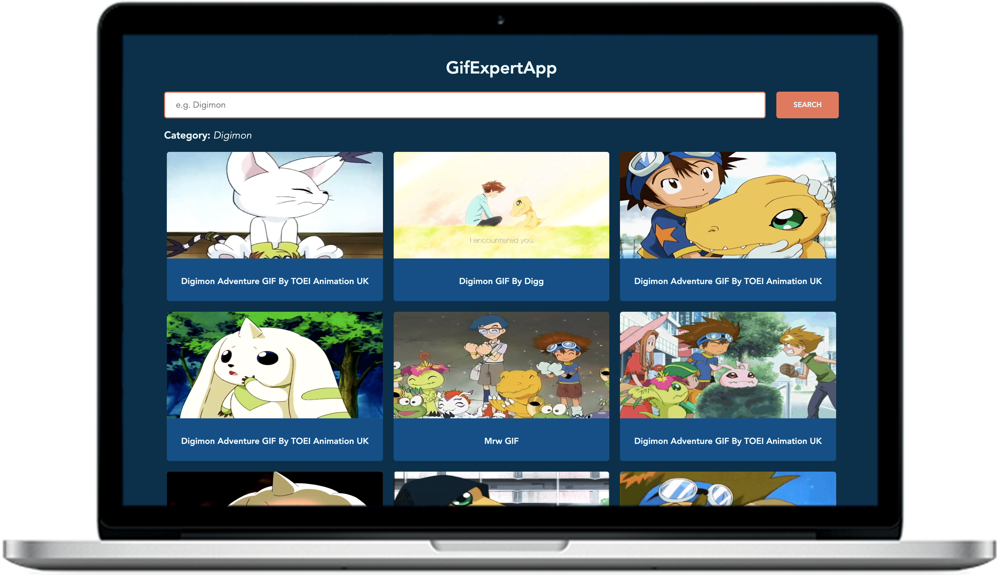
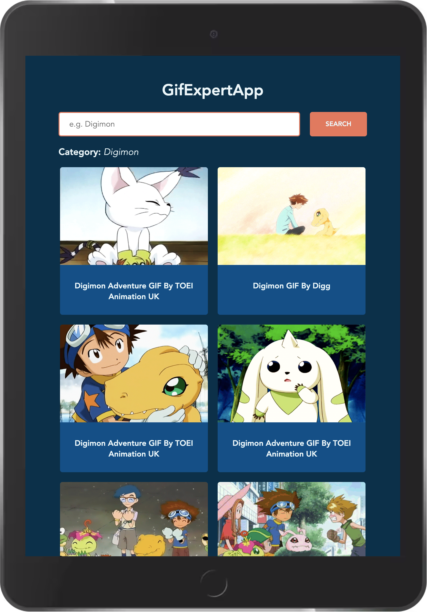
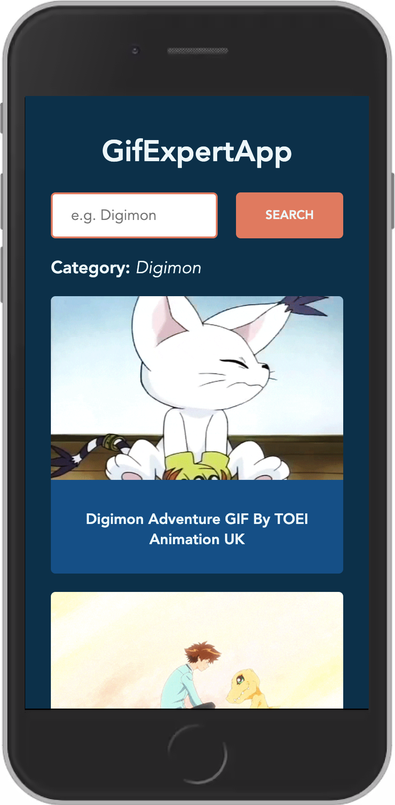

# Gif Expert App

Esta aplicación funciona con la API de [Giphy Developers](https://developers.giphy.com/ 'Sitio de Giphy Developers') por lo que para utilizarla es necesario configurar el archivo `.env`

## Capturas de pantalla

La app está optimizada para distintos tamaños de pantalla.

### Laptop

### Tablet

### Móvil

